## aws-ecs-troubleshooting-lab

### Project Overview

This project simulates a real-world cloud support scenario where a containerized LMS (Learning Management System) application deployed on AWS ECS Fargate experiences critical failures.

As a Cloud Support Engineer, the objective was to diagnose and resolve issues related to networking, IAM permissions, and load balancing.

---

## Architecture Diagram

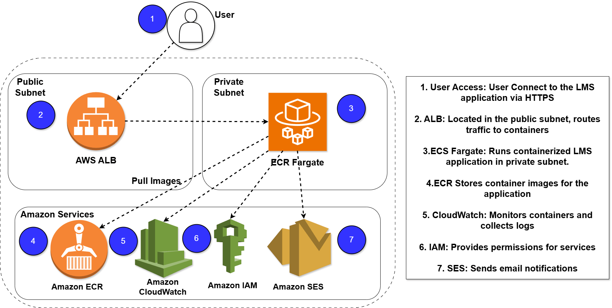

---

## Technologies Used

* AWS ECS (Fargate)
* Application Load Balancer (ALB)
* Amazon ECR
* Amazon CloudWatch
* AWS IAM
* AWS VPC (Public & Private Subnets)

---

## Issues Simulated

* ECS tasks failing to start due to misconfigured IAM roles
* ALB health checks failing due to incorrect target group settings
* Security group misconfigurations blocking traffic
* Container image pull failures from ECR

---

## Troubleshooting Process

1. Checked ECS task logs using CloudWatch
2. Identified IAM permission issues preventing container startup
3. Verified ALB target group and health check configuration
4. Fixed security group rules to allow proper traffic flow
5. Validated container image availability in ECR

---
## Environment Setup (AWS Infrastructure)

## Overview

This section outlines the setup of the AWS environment required to host a containerized Learning Management System (LMS). It includes IAM roles, networking (VPC), and security group configurations necessary for a secure and scalable deployment.

Prerequisites
AWS account with administrative access
Basic understanding of AWS networking concepts
Access to AWS Console

Step 1: AWS Account & Region Setup
Logged into AWS Console
Selected region: us-east-1

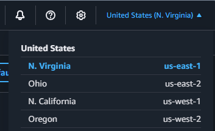

Step 2: IAM Role Configuration

Created two IAM roles for ECS:

1. ECS Service Role
 * Service: Elastic Container Service
 * Role Name: EduTech-ECS-Service-Role

2. ECS Task Execution Role
 * Role Name: EduTech-ECS-Task-Role
 * Policies attached:
   * AmazonECSTaskExecutionRolePolicy
   * CloudWatchLogsFullAccess
     
EduTech-ECS-Service-Role:

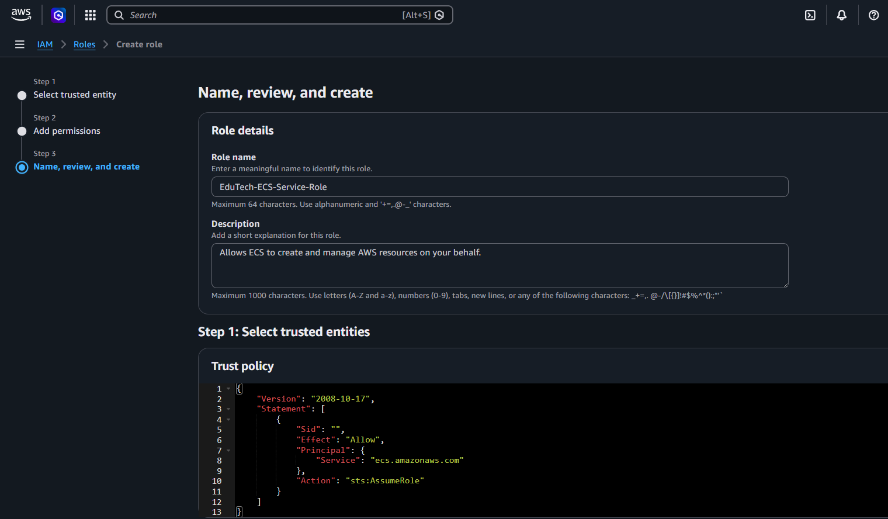

EduTech-ECS-Task-Role:

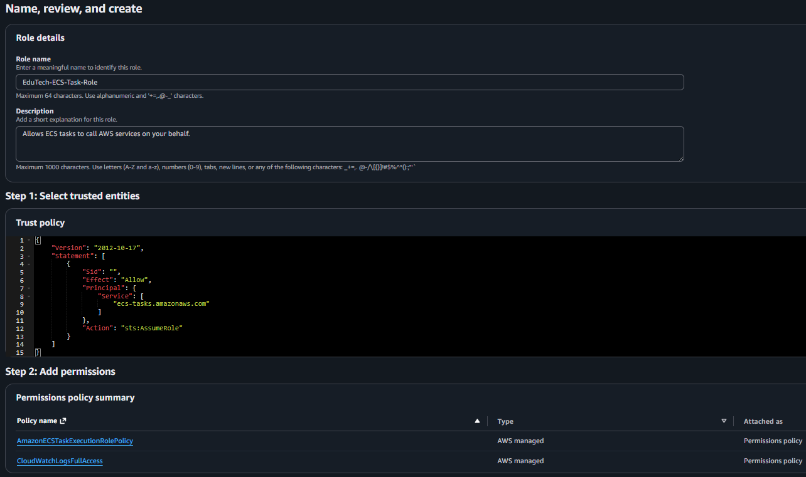

Step 3: VPC Network Setup

Created a custom VPC:

* Name: EduTech-VPC
* CIDR: 10.0.0.0/16
* Availability Zones: 2
* Public Subnets: 2
* Private Subnets: 0 (lab simplification)
* NAT Gateway: None

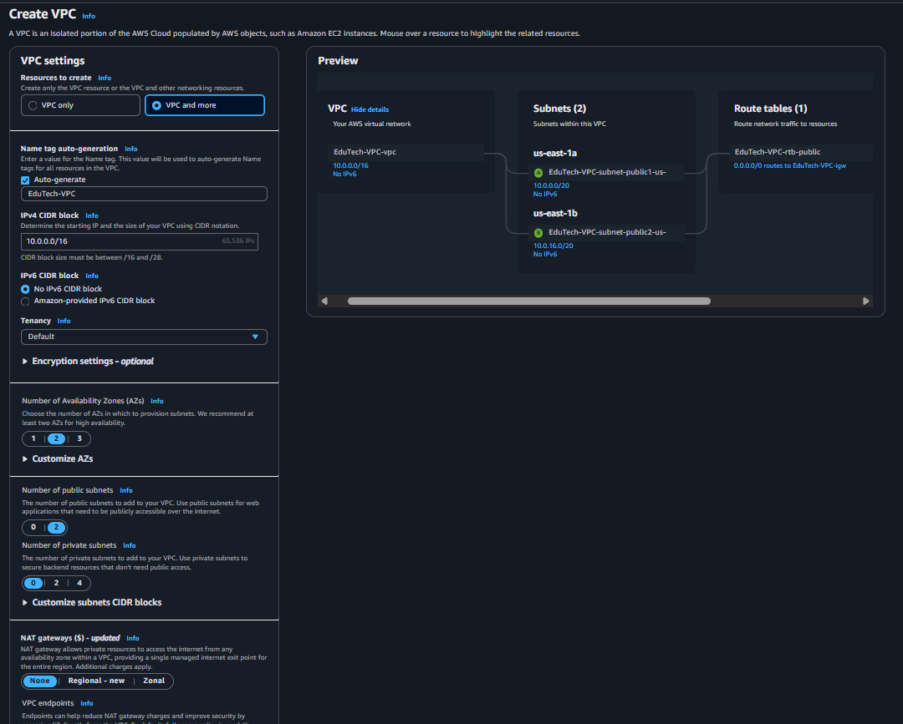

Step 4: Security Groups Configuration
ALB Security Group (EduTech-ALB-SG)
HTTP (80) → 0.0.0.0/0
HTTPS (443) → 0.0.0.0/0
Container Security Group (EduTech-Container-SG)
Port 3000 → Only from ALB security group

ALB security group rules:

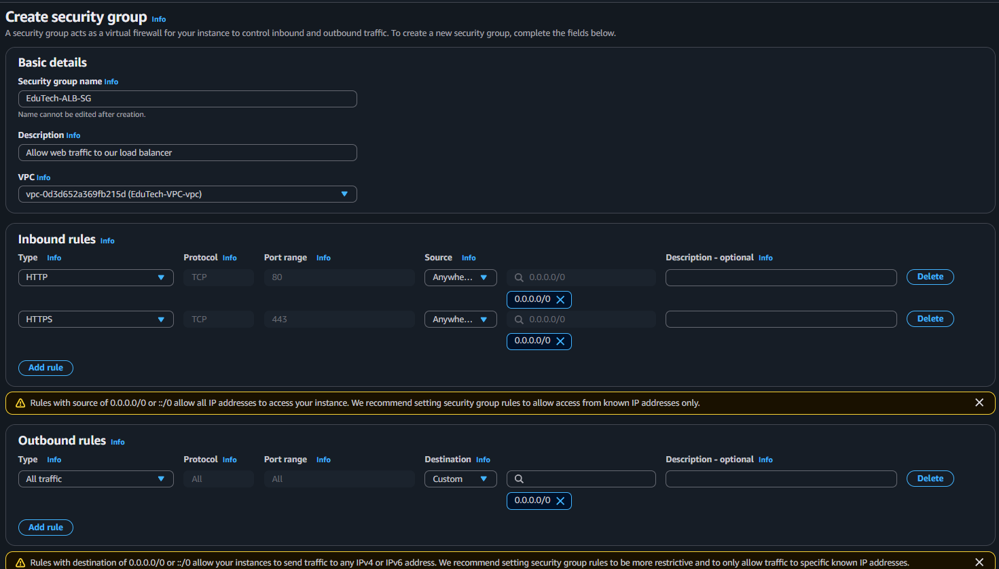

Container security group rules:

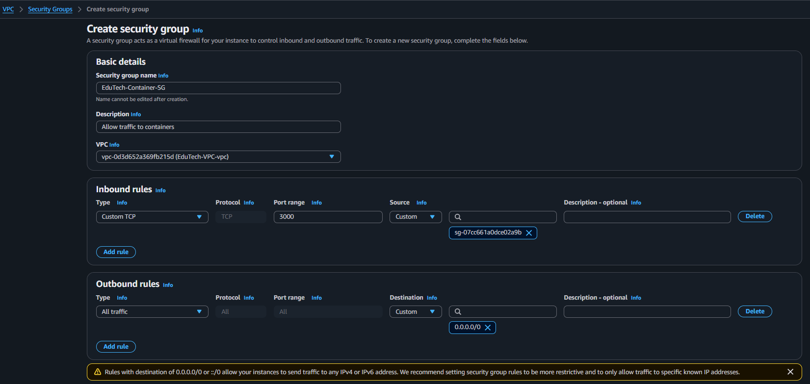

Step 5: Resource Documentation

Recorded key resource identifiers:

VPC ID & Subnet IDs:
  
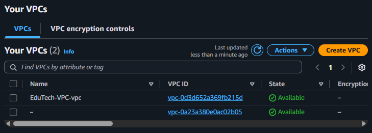

Security Group IDs:

IAM Role ARNs:

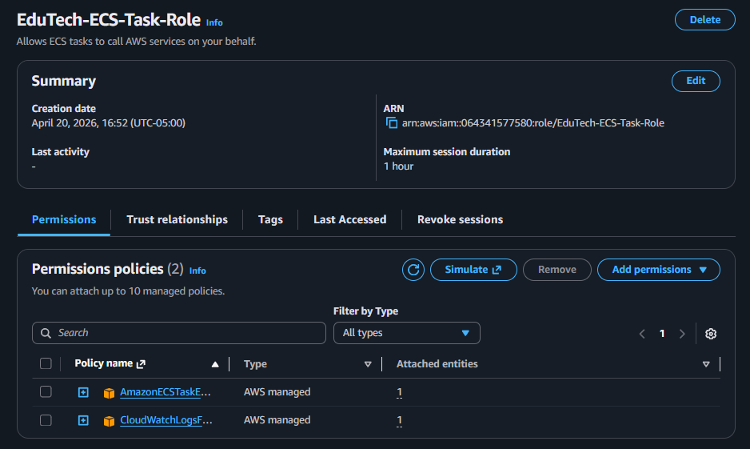

## Container Deployment & ECS Setup

### Overview

In this phase, I containerized a React-based LMS frontend application using Docker and published the image to Amazon Elastic Container Registry (ECR). This prepares the application for deployment using AWS ECS in the next phase.
### Steps Performed

#### Step 1: Create ECR Repository

Created a repository to store container images.

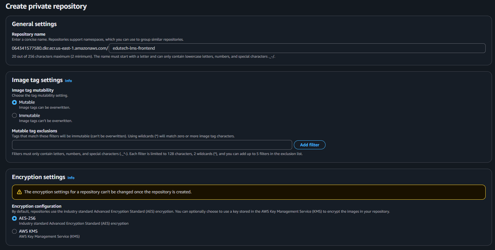

#### Dockerfile Overview

The application was containerized using a custom Dockerfile based on a lightweight Node.js image.

Key configurations include:

- Using `node:16-alpine` for a minimal base image  
- Installing dependencies before copying full source code to optimize Docker layer caching  
- Building the React application for production (`npm run build`)  
- Serving static files using a lightweight Node server (`serve`)  
- Exposing port 3000 for application access  

📸 Screenshot:  
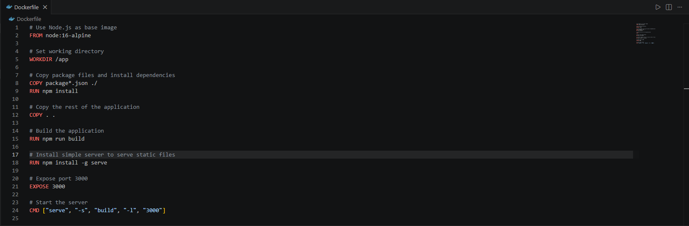

#### Step 2: Build and Push Docker Image

- Built the LMS application Docker image locally using a custom Dockerfile  
- Tagged the image with the Amazon ECR repository URI to prepare for cloud deployment  
- Authenticated Docker with AWS using the AWS CLI  
- Successfully pushed the container image to Amazon ECR  

This process enables AWS ECS Fargate to securely pull and run the application in a scalable, containerized environment.

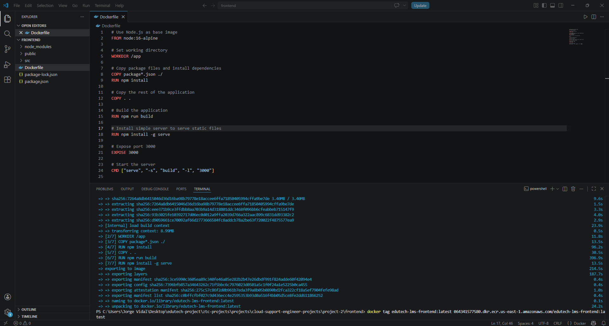

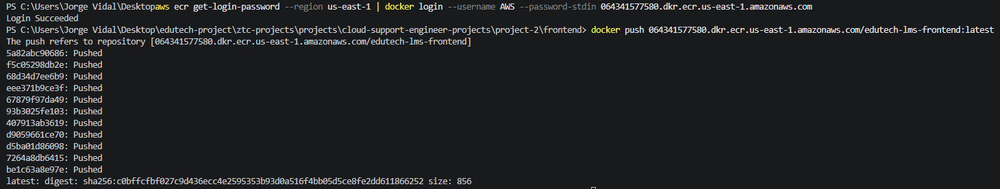

#### Step 3: Verify Image in Amazon ECR

- Navigated to the Amazon ECR repository (`edutech-lms-frontend`)
- Confirmed the container image was successfully pushed with the `latest` tag
- Verified image metadata including URI, size, and status

📸 Screenshot:
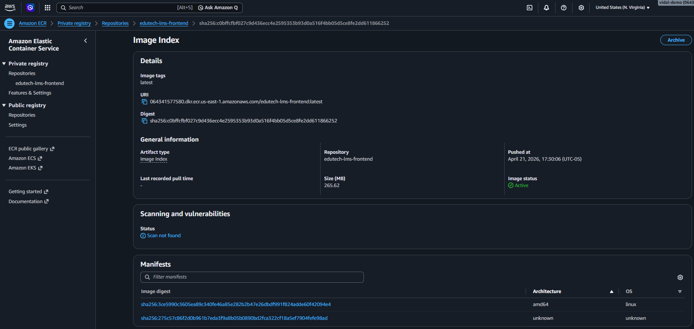

The successful presence of the image in ECR confirms that the container is ready to be deployed via AWS ECS.

##  ECS Deployment with AWS Fargate

### Overview

In this phase, I deployed the containerized LMS frontend application to AWS using Elastic Container Service (ECS) with Fargate. This serverless deployment model eliminates the need to manage infrastructure while enabling scalable and highly available container execution.

---

### Steps Performed

#### Step 1: Create ECS Cluster

- Created an ECS cluster (`EduTech-LMS-Cluster`)
- Selected AWS Fargate as the launch type (serverless infrastructure)

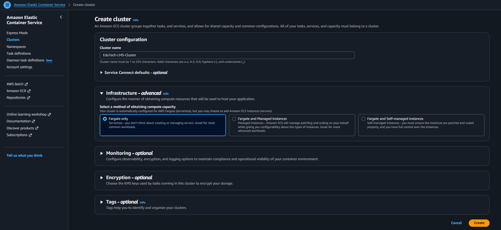

*Fargate removes the need to manage EC2 instances, simplifying deployment and scaling.*

#### Step 2: Create Task Definition

- Defined task configuration (`EduTech-LMS-Task`)
- Configured container to use ECR image
- Set resource allocation (CPU & memory)
- Configured port mapping (3000 → HTTP)

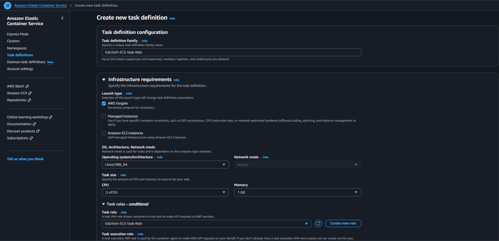

*Task definitions define how containers run, including compute resources and networking.*

#### Step 3: Configure Application Load Balancer

- Created an internet-facing Application Load Balancer (`EduTech-LMS-ALB`)
- Configured target group (`EduTech-LMS-TG`)
- Set health check path (`/`)
- Associated ALB with public subnets
  
Application Load Balancer:
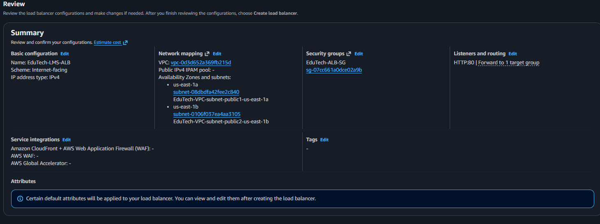 

Target Group:
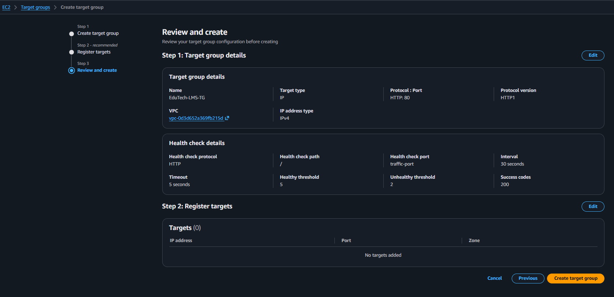

*The ALB distributes incoming traffic and performs health checks for high availability.*

#### Step 4: Create ECS Service

- Deployed service (`EduTech-LMS-Service`) using Fargate
- Linked service to task definition and load balancer
- Configured networking (VPC, subnets, security groups)
- Set desired task count to maintain availability

ECS Service:
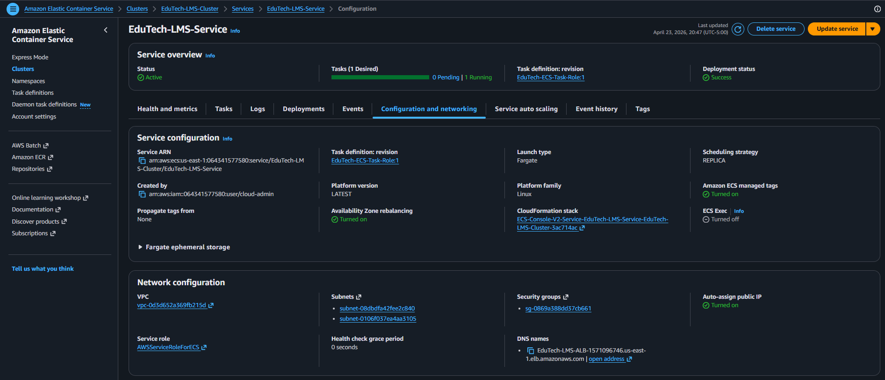

*ECS Service ensures containers remain running and automatically integrates with load balancing.*

#### Step 5: Access Application

- Retrieved Application Load Balancer DNS name
- Accessed deployed LMS frontend via browser

## Key Outcomes

In this phase of the project, I successfully:

- Designed and provisioned an ECS cluster using AWS Fargate to support serverless container workloads  
- Defined and configured task definitions to control container runtime behavior and resource allocation  
- Implemented an Application Load Balancer to distribute incoming traffic and enable high availability  
- Deployed a containerized LMS frontend application, making it accessible through a public endpoint  

This phase demonstrates the end-to-end deployment of a cloud-native application using AWS-managed container services.

## ECS Troubleshooting: From Symptoms to Solutions

### Overview

In this phase, I simulated a container failure by introducing an invalid health check to observe how ECS handles unhealthy tasks and recovers from errors.

Issue Introduced (Task Revision 3)

### Configured an invalid health check:

CMD-SHELL, curl -f http://localhost:3000/non-existent-path || exit 1

Failure Evidence

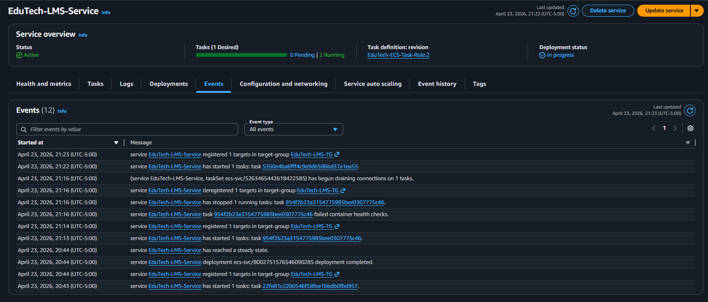

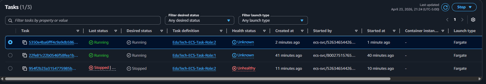

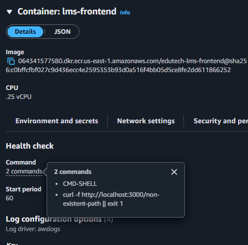

Diagnosis
Tasks failed health checks and were marked UNHEALTHY
ECS Events tab showed repeated “failed container health checks” messages
Tasks were marked UNHEALTHY and moved to STOPPED state
ECS continuously stopped and restarted containers

### Resolution

Updated the health check to a valid endpoint and created a new task revision:

CMD-SHELL, curl -f http://localhost:3000/ || exit 1

### Service Recovery

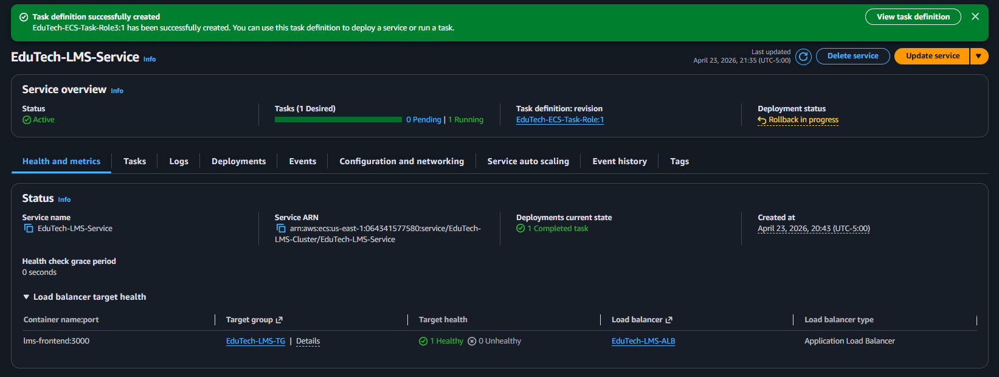

- Updated task definition with a valid health check endpoint  
- Redeployed ECS service using the latest revision  
- ECS successfully replaced failing tasks and restored service stability  

## Troubleshooting ALB Health Check Misconfiguration

### Overview

In this phase, I simulated an Application Load Balancer (ALB) misconfiguration to understand how incorrect health check settings impact service availability and traffic routing.

### Issue Introduced (Health Check Port Misconfiguration)

The target group health check was intentionally configured with an incorrect port:

Health Check Port: 3001 (incorrect)
Application Port: 3000 (actual)

Observing the Failure

After applying the misconfiguration, I monitored the target group:

- Targets transitioned from Healthy → Unhealthy
- Health checks failed consistently
- Errors indicated connection timeout / refused connection

 

 

Using the AWS Console, I identified the root cause:
- ALB health checks were targeting the wrong port
- The application was running on port 3000, but ALB checked 3001
- This caused all targets to fail health checks

Additionally:

- Healthy host count dropped to zero
- ALB stopped routing traffic entirely

Impact:
- Application became inaccessible via the load balancer
- No healthy targets available to serve requests
- Simulated a real-world outage caused by configuration error

Resolution: Fixing the Health Check

To restore service, I corrected the health check configuration:

Health Check Port: traffic-port
This ensures the ALB checks the correct port that the application is listening on.

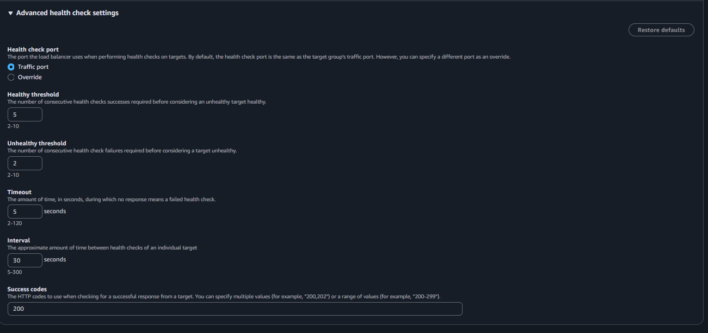
 
Recovery Monitoring

After applying the fix:

- Targets gradually transitioned back to Healthy
- Health checks began passing successfully
- ALB resumed normal traffic routing

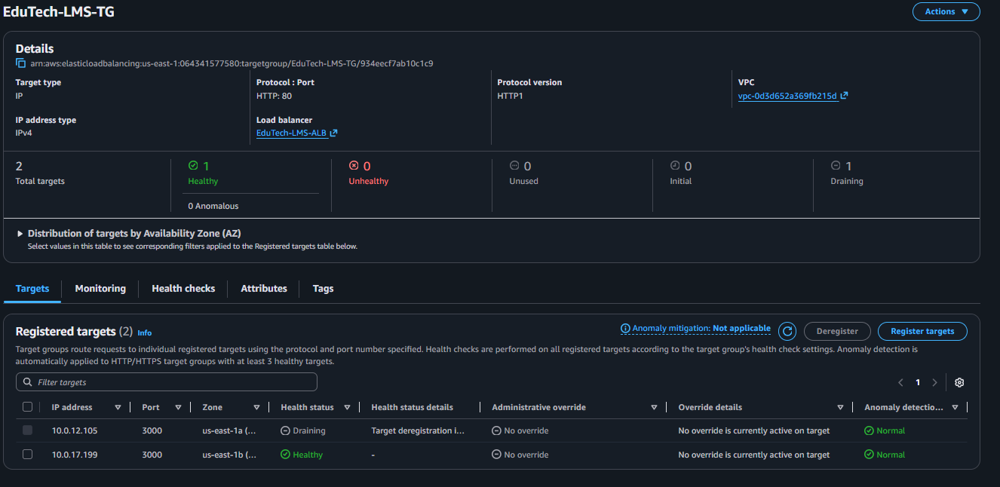

Result
- Service was fully restored
- Targets stabilized in a Healthy state
- Application became accessible again via the load balancer

Summary
This exercise demonstrated how a simple ALB health check misconfiguration can disrupt service availability and how to systematically diagnose and resolve the issue using AWS tools.

---
